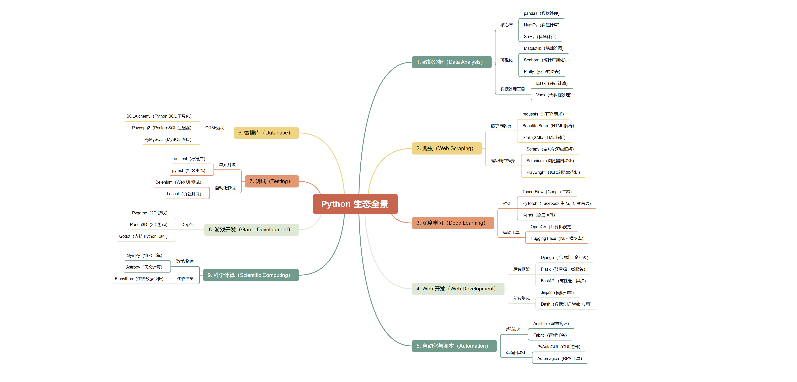
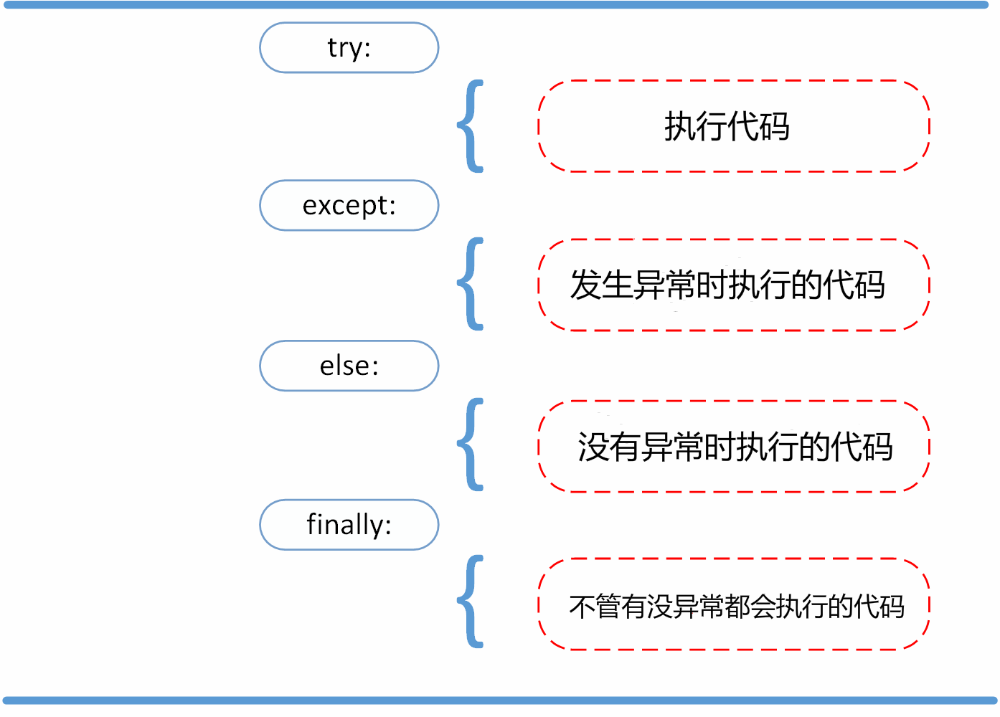

# Python高级技巧

## 生态全景



## 文档
* [官方文档](https://docs.python.org/zh-cn/3.13/)
* [第三方库](https://pypi.org/)
* [Conda](https://docs.conda.io/projects/conda/en/stable/)
* [Miniconda](https://www.anaconda.com/docs/main)

## 安装
* Python：推荐安装v3.10+版本，以下所有代码示例均基于Python@3.10+。
* Conda：推荐安装Miniconda。

## VSCode插件


## 虚拟环境
强烈建议任何时候都通过类似`Conda`这样的工具创建一个虚拟环境并指定`Python`版本。
```py
# 规则
$ conda create -n your_env_name python=版本号

# 示例
$ conda create -n open_webui python=3.11
```
`Conda`常见命令如下：
```py
# 激活某个虚拟环境
$ conda activate your_env_name

# 取消激活当前虚拟环境
$ conda deactivate

# 查看所有虚拟环境
$ conda env list

# 删除某个虚拟环境
$ conda env remove -n your_env_name
```

## 高级技巧

### 错误和异常
如果要处理`Python`中的异常，可以使用`try/except`语法，其完整语法如下：

```py
def safe_divide(x, y):
  try:
    if x == y:
      raise ValueError("除数不能与被除数相等")
    result = x / y
  except ValueError as e:
    print(f"错误：{e}")
  except ZeroDivisionError:
    print("错误：除数不能为零！")
  except TypeError:
    print("错误：请输入数字类型！")
  except Exception as e:
    print("未知错误")
  else:
    print(f"计算结果：{x} / {y} = {result}")
    return result
  finally:
    print("计算结束（无论是否出错都会执行）")

# 测试用例
if __name__ == "__main__":
  # 正常情况
  safe_divide(10, 2) # 触发 else

  # 自定义错误
  safe_divide(2, 2) # 触发ValueError
  
  # 除零错误
  safe_divide(10, 0) # 触发 ZeroDivisionError
  
  # 类型错误
  safe_divide("10", 2) # 触发 TypeError
  
  # 其他未知错误
  safe_divide(10, None) # 触发 TypeError（会被最后一个 except 捕获）

```

### 装饰器
**装饰器(`Decorator`)**: 是`Python`中一种修改或增强函数/类行为的高级语法，基于闭包和函数式编程实现，它允许在不修改源代码的情况下，通过装饰器的语法动态添加功能(如日志，计时，权限校验等)。
```py
import time

def timer(func):
  def wrapper(*args, **kwargs):
    start = time.perf_counter()
    res = func(*args, **kwargs)
    end = time.perf_counter()
    print(f"函数{func.__name__}运行时间：{end - start:.4f}秒")
    return res
  return wrapper

@timer
def heavy_computation(n):
  return sum(i * i for i in range(n))

heavy_computation(10**6) # 函数heavy_computation运行时间：0.0356秒
```
**自定义迭代器**： 可以把一个类作为一个迭代器，只需要在类中实现`__iter__`和`__next__`即可。
```py
# 自定义迭代器
class AutoIncrementNumber:
  def __iter__(self):
    self.num = 1
    return self
  def __next__(self):
    if self.num > 5:
      raise StopIteration
    x = self.num
    self.num += 1
    return x

myClass = AutoIncrementNumber()
myIter = iter(myClass)

print(next(myIter)) # 1
print(next(myIter)) # 2
print(next(myIter)) # 3
print(next(myIter)) # 4
print(next(myIter)) # 5
print(next(myIter)) # 报错
```

### 生成器
**生成器**：在`Python`中，如果一个函数使用了`yield`，则这个函数被称为”生成器“。

**区别**：和普通函数不同的是，生成器是一个返回迭代器的函数，只能用于迭代操作。
```py
def countDown(n):
  while n > 0:
    yield n
    n -= 1

generator = countDown(5)

for val in generator:
  print(val) # 5 4 3 2 1
```

### 推导式
**推导式(Comprehension)**：是一种简洁高效的语法结构，用于快速创建数据容器(列表、字典、集合等)
```py
# 列表推导式
# 语法: [expression for item in iterable if condition]
squares = [x**2 for x in range(1, 5)]
evens = [x for x in range(10) if x % 2 == 0]
print(squares) # [1, 4, 9, 16]
print(evens) # [0, 2, 4, 6, 8]

# 字典推导式
# 语法: {key_expression: value_expression for item in iterable if condition}
d = {'a': 1, 'b': 2}
reversed_d = {v: k for k, v in d.items()}
print(reversed_d) # {1: 'a', 2: 'b'}

# 集合推导式
# 语法: {expression for item in iterable if condition}
words = ['hello', 'world', 'hello']
unique_upper = {word.upper() for word in words}
print(unique_upper) # {'HELLO', 'WORLD'}

# 生成器推导式
# 语法: (expression for item in iterable if condition)
gen = (x**2 for x in range(20) if x % 3 == 0)
print(next(gen))  # 0 (逐个生成，节省内存)
print(next(gen))  # 9 (逐个生成，节省内存)
print(next(gen))  # 36 (逐个生成，节省内存)
```

### Lambda表达式
::: warning
lambda表达式中不能使用多分支
:::
`lambda`表达式：是`Python`中一种匿名函数，用关键词`lambda`定义，通常用于简化代码，特别是在需要短小函数的地方。

基本语法：`lambda arguments: expression`
```py
# lambda表达式和普通函数
add_lambda = lambda a, b: a + b

# 和add_lambda等价
def add_func(a, b):
  return a + b

print(add_func(1, 2)) # 3
print(add_lambda(1, 2)) # 3

# lambda表达式和map函数
squares = list(map(lambda x: x**2, range(3)))
print(squares) # [0, 1, 4]
```

### File文件操作
在`Python`中，`Open`方法用于打开一个文件，并返回文件对象。
语法格式：`open(file_path, mode)`
```py
file_path = "./file.txt"

def create_file(file_path):
  """创建一个文件"""
  with open(file_path, 'w') as f:
    f.write("Hello, World\n")
    f.write("Hello, Python\n")
    f.write("Hello, Vue.js\n")

def view_file(file_path):
  """查看文件内容"""
  with open(file_path, 'r') as f:
    # 全部读取
    print(f.read())

    # 按行读取
    for line in f.readlines():
      print(line)

def edit_file(file_path):
  """编辑文件内容(追加)"""
  with open(file_path, 'a') as f:
    f.write("Hello, React.js\n")
    f.write("Hello, Vite\n")

# 创建文件
create_file(file_path)

# 查看文件
view_file(file_path)

# 编辑文件
edit_file(file_path)

# 查看文件
view_file(file_path)
```