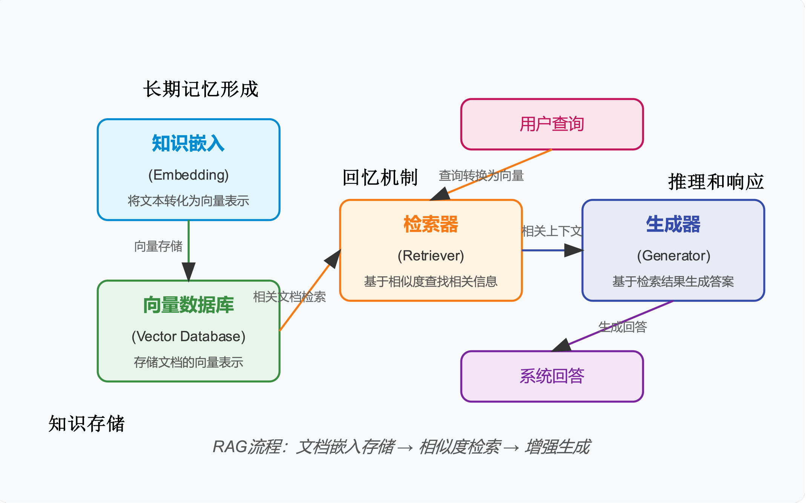

# RAG基础

## 系统架构



## 相关名词
* RAG
* Embedding
* Vector
* Vector DB
* Retriever

## 关键技术

### Embedding

### Vector和Vector DB

### Retriever

## 简易RAG

### 前置准备
::: tip
所有跟llm请求相关的，默认都基于DeepSeek
:::
首先定义环境变量文件`.env`，其代码如下：
```env
# DeepSeek api key
DEEPSEEK_API_KEY = 'your api key'

# DeepSeek endpoint
DEEPSEEK_API_BASE = 'https://api.deepseek.com/v1'
```
然后安装一个依赖包：
```sh
$ pip install dotenv
```
接着定义两个文件`env_tools.py`和`chain.py`，其代码分别是：
```py
# env_tools.py
import os
from dotenv import load_dotenv, find_dotenv

load_dotenv(find_dotenv())

def get_api_key():
  return os.getenv('DEEPSEEK_API_KEY')

def get_api_base():
  return os.getenv('DEEPSEEK_API_BASE')
```

```py
# chain.py
from env_tools import get_api_key, get_api_base

api_key = get_api_key()
api_base = get_api_base()

print(api_key)
print(api_base)
```

### 公共部分
::: tip
公共部分指的是LangChain和LangGraph中部分处理代码是一样的。
:::

安装`langchain_community`包，并使用`loader`加载网页数据。
```py
from langchain_community.document_loaders import WebBaseLoader

# 加载网页数据
web_data = WebBaseLoader(
  web_path="https://zh.wikipedia.org/wiki/黑神话：悟空"
).load()

print(web_data)
```

安装`langchain_text_splitters`包，并使用分割器分割网页数据。
```py
from langchain_text_splitters import RecursiveCharacterTextSplitter
text_splitter = RecursiveCharacterTextSplitter(
  chunk_size=1000,
  chunk_overlap=200
)
text_split_data = text_splitter.split_documents(web_data)

print(text_split_data)
```

安装`langchain-huggingface`，并设置`embedding`。
```py
from langchain_huggingface import HuggingFaceEmbeddings

embedding = HuggingFaceEmbeddings(
  model_name="BAAI/bge-small-zh-v1.5"
)
```

安装`langchain_core`，并设置向量存储。
```py
from langchain_core.vectorstores import InMemoryVectorStore

vector_store = InMemoryVectorStore(embeddings)
vector_store.add_documents(text_split_data)
```

至此，网页数据已经向量化存入到我们的内存中。

### LangChain实现RAG
存入内存以后，需要做检索相关的工作。
```py
# retriever
question = "黑神话是哪家公司开发的，是什么类型的游戏，什么时间发布的？"
retriever_docs = vector_store.similarity_search(
  query=question,
  k=2
)
retriever_content = "\n\n".join(doc.page_content for doc in retriever_docs)

print(retriever_content)
```

向量存储检索完毕后，接下来要准备检索内容放置到提示词中。
```py
# prompt
from langchain_core.prompts import ChatPromptTemplate

prompt = ChatPromptTemplate.from_template("""
  请你依据上下文来回答问题\n
  如果上下文中没有，你直接回答"抱歉，我无法从上下文中提供相关信息。"
  上下文：{context}
  问题：{question}
  回答：
""")
query = prompt.format(
  context=retriever_content,
  question=question
)

print(query)
```
最后，安装`langchain_deepseek`，并调用大模型`api`得到结果。
```py
llm = ChatDeepSeek(
  model="deepseek-chat",
  api_key=api_key,
  temperature=0.5
)
response = llm.invoke(
  input=query
)

print(response.content)
```
最后回答：
```markdown
1. **开发公司**：游戏科学（Game Science）  
2. **游戏类型**：动作角色扮演（ARPG）  
3. **发布时间**：  
   - Microsoft Windows 和 PlayStation 5 平台：**2024年8月20日**  
   - Xbox Series X/S 版：**待定**（暂未发售）  

其他补充：  
- 中国新华社称其为“中国首款3A游戏”，改编自《西游记》。  
- 首发3天销量破1000万份，一个月内销量超2000万份。
```

### LangGraph实现RAG
::: tip
LangGraph和LangChain对于向量存储`vector_store`以及之前的步骤相同。
:::

首先需要安装`langgraph`：
```sh
$ pip install langgraph
```
然后设置定义`State`、`Retriever`和`Generation`。
```py
from langchain import hub
from typing_extensions import TypedDict
from langchain_deepseek import ChatDeepSeek
from langchain_core.documents import Document
from langgraph.graph import START, StateGraph
from typing import List

# prompt
prompt = hub.pull("rlm/rag-prompt")

class State(TypedDict):
  question: str
  context: List[Document]
  answer: str

# retrieve
def retrieve(state: State):
  retriever_docs = vector_store.similarity_search(
    query=state['question'],
    k=2
  )
  retriever_content = "\n\n".join(doc.page_content for doc in retriever_docs)
  return { "context": retriever_content }

# generate
def generate(state: State):
  llm = ChatDeepSeek(
    model="deepseek-chat",
    api_key=api_key,
    temperature=0.5
  )
  query = prompt.invoke({
    "question": state['question'],
    "context": state['context']
  })
  response = llm.invoke(
    input=query
  )
  return { "answer": response.content }
```

最后定义`Graph`并调用大模型`API`得到结果：
```py
graph = (
  StateGraph(State)
  .add_sequence([retrieve, generate])
  .add_edge(START, 'retrieve')
  .compile()
)

question="黑神话是什么公司开发的，什么类型的游戏，什么时间发布？"
response_content = graph.invoke({ "question": question })
print(response_content.get('answer'))
```

最后回答：
```text
黑神话：悟空》是由游戏科学开发的动作角色扮演游戏，于2024年8月20日发布。
```

### LangChain vs LangGraph

| 对比维度        | LangChain | LangGraph |
|-----------------|-----------|-----------|
| **架构设计**    | 链式（`Chain-based`），线性流程 | 图状（`Graph-based`），支持 `DAG`（有向无环图） |
| **RAG 典型实现** | `RetrievalQA` 链，顺序执行：查询 → 检索 → 生成 | 可分解为多个节点，支持动态路由、多轮检索 |
| **复杂任务处理** | 需要嵌套链，适用于简单到中等复杂度任务 | 原生支持复杂逻辑、条件分支、循环 |
| **并行处理能力** | 顺序执行为主，并行需额外实现 | 内置并行执行，可同时运行独立节点 |
| **状态管理**    | 通过 `Memory` 组件管理 | 更灵活，可跟踪全局状态 |
| **调试与可观察性** | 基本回调系统，调试较简单 | 完整执行跟踪，可视化更直观 |
| **学习曲线**    | 较低，适合快速上手 | 较高，需理解图计算概念 |
| **性能**        | 简单任务开销小 | 复杂任务更高效（支持并行） |
| **适用场景**    | 标准问答、简单 `RAG`、快速原型 | 多阶段 `RAG`、动态决策、企业级应用 |
| **错误处理**    | 相对简单 | 更健壮，支持节点级错误恢复 |
| **扩展性**      | 适合小型到中型项目 | 更适合大型、高定制化系统 |

总结：
* **LangChain**：适合简单、线性的 `RAG` 任务，开发速度快，学习成本低。
* **LangGraph**：适合复杂、动态的 `RAG` 系统，支持并行、条件分支和循环，适合企业级应用。

## 数据导入DataLoad

## 文本切块DocChunking

## 向量嵌入Embedding

## 向量存储VectorDB

## 检索前处理PreRetriever

## 索引优化Indexing

## 检索后处理PostRetriever

## 回答生成Generate

## 系统评估Evaluation

## RAG高级技巧